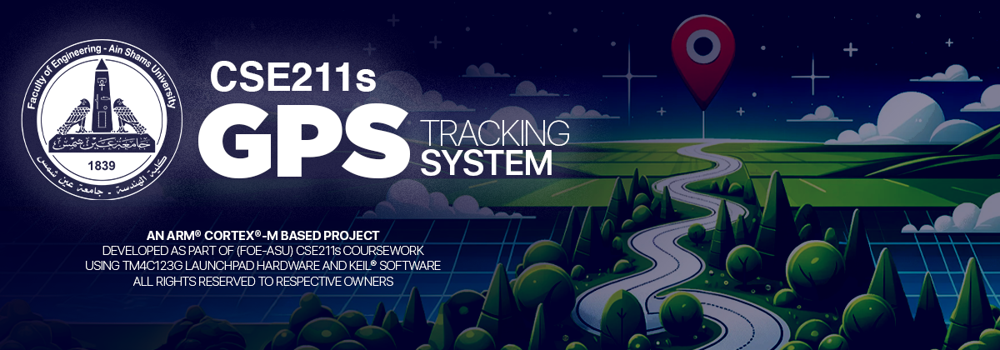

 

# GPS Tracking System 📡🌍

## 📜 Project Description
This project is developed for the course "Introduction to Embedded Systems" (CSE 211s, Spring24) at the (FOE-ASU) CSE Dept.  
The goal is to create a GPS tracking system that collects real-time positional coordinates from a microcontroller in motion and displays this trajectory on a map.

## 🌟 Features
- **Data Collection:** Captures real-time GPS coordinates 📍.
- **End Point Detection:** Stops data collection based on distance (>100m), button press, or a predefined destination 🏁.
- **LED Notification:** Indicates when the destination point is reached 🔔.
- **Data Transfer:** Sends the collected data to a PC via UART when commanded ⬆️.

## 🏁 First Milestone
- [**`Documentation`**](./Documentation.pdf): A detailed project report including screenshots of our simulations and results.
- [**`COTS/MCAL/GPIO`**](./COTS/MCAL/GPIO): Full GPIO driver implementation (initalization and control) for the TivaC TM4C123G microcontroller.
- [**`COTS/MCAL/UART`**](./COTS/MCAL/UART): Full UART driver configuration (initalization and control) for the TivaC TM4C123G microcontroller.
- [**`COTS/HAL/GPS`**](./COTS/HAL/GPS): GPS module driver configuration, parsing and proper reading.
- [**`COTS/HAL/LED`**](./COTS/HAL/LED): LED configuration and control.
- [**`COTS/APP`**](./COTS/APP): Application layer testing and implementing GPS-related functionality.
- [**`Final Program`**](./Final%20Program): Full fledged package, combining all the previous modules.
- [**`Test Programs`**](./Test%20Programs): Individual testing programs for each module.

## ⚙ Hardware Requirements
- Microcontroller development board ( ARM® Cortex®-M4F Based MCU TM4C123G "TivaC" ) 🖥️
- GPS module 🛰️
- Personal computer (PC) 💻
- Connecting cables (USB, serial, etc.) 🔌

## 👨‍💻 Software Requirements
- C development environment (e.g., Keil) 💾
- PC-based application development environment (e.g., Python with Matplotlib or a mapping API) 📊

## 🛠 Setup and Operation
1. **Configure Interfaces:** Setup UART interfaces for the GPS module and PC. Prepare digital output for built-in LED.
2. **Initialization:** On power-on, the system should read GPS data and wait for a valid GPS fix 🛠️.
3. **Data Logging:** Continuously log the GPS coordinates, updating the trajectory until the end conditions are met 📝.
4. **Data Visualization:** Utilize PC-based software to draw and display the trajectory on a map 🗺️.

## 🤝 Contributing
Feel free to fork this repository, make changes, and submit pull requests if you have improvements or new features to add 👍.

## ✨ Team Members ✨

<table style="margin-left: auto; margin-right: auto;">
<tr>
    <td align="center"><a href="https://github.com/dizzydroid"> dizzydroid</a></td>
    <td align="center"><a href="https://github.com/DopeBiscuit"> DopeBiscuit</a></td>
    <td align="center"><a href="https://github.com/unauthorised-401"> unauthorised-401</a></td>
    <td align="center"><a href="https://github.com/SeifT101"> SeifT101</a></td>
    <td align="center"><a href="https://github.com/seifelwarwary"> seifelwarwary</a></td>
</tr>
<tr>
    <td align="center"><a href="https://github.com/Spafic"> Spafic</a></td>
    <td align="center"><a href="https://github.com/Lucifer3224"> Lucifer3224</a></td>
    <td align="center"><a href="https://github.com/MashaWaleed"> MashaWaleed</a></td>
    <td align="center"><a href="https://github.com/moazragab12"> moazragab12</a></td>
    <td align="center"><a href="https://github.com/AshrafByte"> AshrafByte</a></td>
</tr>
</table>

## 📜 License
Check the [License](LICENSE) file for details.